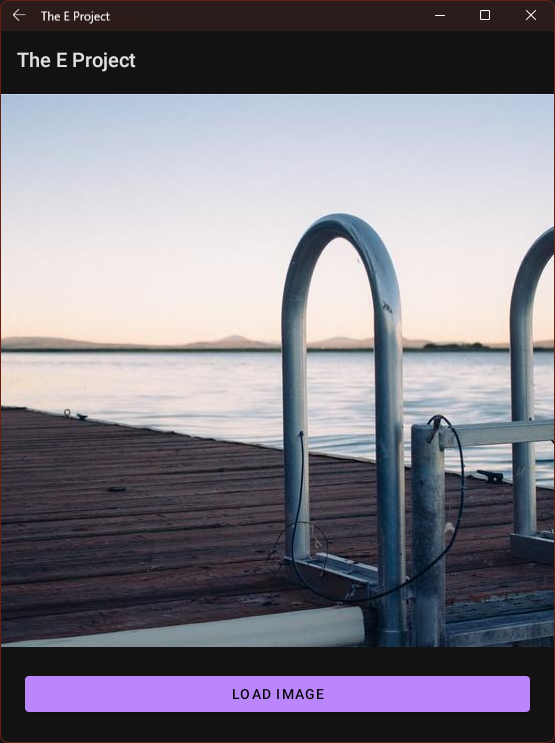

# e_project_task
Sample Project Task for The E Foundation

## Specifications
1. Create a simple Android app with a button and a placeholder (i.e. an area where content will be displayed).
2. When the button is clicked, an image is fetched from a public service that provides random images like https://picsum.photos/ or https://placekitten.com/.
3. The image is shown on the placeholder.
4. If you press the button again, a new random image is fetched.
5. When the app/activity exits/is killed, the last image is cached. The next time the app is opened, it shows the last image on the placeholder, with no network request nor loading time.
6. If no network connection (e.g. airplane mode), a message is shown somewhere (think Android UI guidelines) and the last image fetched remains.
7. Localize the button and the error message for no connection, e.g. in your language and English.

## Screenshot

